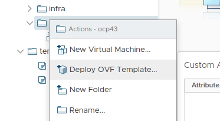

# Installing OCP 4.3 on VMware with UPI

In this blog post we will cover how to install Openshift 4.3.1 on VMware vSphere using UPI (User Provisioned Infrastructure). We will use as much automation as we can along the way whilst not abstracting away so much that familiarity with the overall process is impaired.

# Environment Overview and Pre-Requisites 

This post was written and tested against ESXi 6.7.0 and vSphere 6.7.0u3. It is important that in addition to reading this blog post that you familiarize yourself with the official [Openshift documentation](https://docs.openshift.com/container-platform/4.3/installing/installing_vsphere/installing-vsphere.html) for installation.

The steps and code associated with this post are recommendations for a dev/test/POC environment only and are not intended for production use. They are provided as a guide to help you become familiar with OpenShift 4 in a lab environment. The domains, subnets and clusterid used here are for illustration purposes only, and will need to be replaced with something appropriate for your own environment. Here we will use `ktz.lan` for the base domain, `ocp4` for a clusterid, and `192.168.1.0/24` for a subnet. 

## Node Layout

As per the documentation a minimal install of OCP4 requires 1 temporary bootstrap node, 3 master nodes and 2 worker nodes. The bootstrap node will be shortlived and is only required during the install phase to instantiate etcd after which time it can be safely deleted.

You'll also need a node to act as your load balancer and a webserver to serve ignition config files. For your convenience there is an Ansible playbook and Terraform code to configure a node with HAProxy and Apache (running on port 8080) for this purpose in the git repo accompanying this post.

Below is a table showing the nodes we need and the IP addresses for each node.

| Node         | FQDN                   | IP Address    | Other Info          |
|--------------|------------------------|---------------|---------------------|
| loadbalancer | lb.ocp4.ktz.lan        | 192.168.1.160 | RHEL7               |
| master1      | master1.ocp4.ktz.lan   | 192.168.1.161 | etcd-0.ocp4.ktz.lan |
| master2      | master2.ocp4.ktz.lan   | 192.168.1.162 | etcd-1.ocp4.ktz.lan |
| master3      | master3.ocp4.ktz.lan   | 192.168.1.163 | etcd-2.ocp4.ktz.lan |
| worker1      | worker1.ocp4.ktz.lan   | 192.168.1.164 |                     |
| worker2      | worker2.ocp4.ktz.lan   | 192.168.1.165 |                     |
| bootstrap    | bootstrap.ocp4.ktz.lan | 192.168.1.169 |                     |

## DNS

DNS is extremely important to the success of the OpenShift 4 installer. Pay close attention to the records you create and verify each one before installation, especially the first time.

One of the first things to take into consideration is picking a "cluster id" (in this case we are using `ocp4`). Your clusterid uniquely identifies each OpenShift 4 cluster in your domain and also becomes part of the cluster's FQDN.

Using the tool `dig` we can verify our records are as they should be, for example:

```
$ dig master1.ocp4.ktz.lan +short
192.168.1.161
```

OpenShift 4 requires reverse DNS and can verified thus:

```
$ dig -x 192.168.1.161 +short
master1.ocp4.ktz.lan.
etcd-0.ocp4.ktz.lan.
```

OpenShift 4 expects `api.$CLUSTERID` and `api-int.$CLUSTERID` to be configured, they can both be set to the same IP address – which will be the IP of the Load Balancer.

```
$ dig api.ocp4.ktz.lan +short
192.168.1.160
$ dig api-int.ocp4.ktz.lan +short
192.168.1.160
```

A wildcard DNS entry is required too:

```
$ dig *.apps.ocp4.ktz.lan +short
192.168.1.160
```

Finally, ensure that the required etcd `SRV` records are in place.

```
$ dig _etcd-server-ssl._tcp.ocp4.ktz.lan SRV +short
0 10 2380 etcd-0.ocp4.ktz.lan.
0 10 2380 etcd-1.ocp4.ktz.lan.
0 10 2380 etcd-2.ocp4.ktz.lan.
```

The [documentation](https://docs.openshift.com/container-platform/4.3/installing/installing_vsphere/installing-vsphere.html?extIdCarryOver=true&sc_cid=701f2000001OH74AAG#installation-dns-user-infra_installing-vsphere) has extensive notes on DNS and should be reviewed before installation.

## DHCP and Mac Addresses

Dynamically allocated 'static' IPs should be given to each node via MAC address reservation. 

In the provided Terraform code MAC addresses are hardcoded for this purpose, customize them as required. Using the `count` function of Terraform we can give each node a unique mac address but use the length of the list variable to also act as the value for count, full details [in this blog post](https://blog.ktz.me/calculate-terraform-count-using-the-length-of-a-list-during-interpolation/).

```
variable "master_macs" {
    description = "OCP 4 Master MAC Address"
    type        = list(string)
    default     = ["00:50:56:b1:c7:ba", "00:50:56:b1:c7:bb", "00:50:56:b1:c7:bc"]
}
```

This list dictates how many master nodes are created. Enter 3 MACs, and 3 masters will be created by the following snippet from `main.tf`.

```
resource "vsphere_virtual_machine" "masters" {
  name             = "ocp43.master${count.index + 1}"
  ...
  count            = length(var.master_macs)

  ...

  network_interface {
    network_id   = "${data.vsphere_network.network.id}"
    adapter_type = "${data.vsphere_virtual_machine.RHCOS43.network_interface_types[0]}"
    use_static_mac = true
    mac_address = "${var.master_macs[count.index]}"
  }
...
```

See how the above snippet uses the length of the list (containing the mac addresses) to determine how many nodes to create? Each mac is then also associated with the iteration of the count function and can thus be assigned to each node one by one and thus avoids lots of unnecessary repetition in the Terraform code.

## Load Balancer

In this example we build a RHEL7 node to run HAProxy. Configuration files are in the git repo accompanying this post, the code disables selinux as this is aimed at a lab environment only.

> Note: If you have selinux turned on, you will need to ensure `setsebool haproxy_connect_any on` is allowed in order for stats to bind to port 1936 with this config. 

## Web Server

An Apache web server is used to provide the Red Hat CoreOS bootstrap node with the required ignition config file. In this example we configured it to run on port 8080 on the same node as the load balancer. Again, all required files are available in the git repo accompanying this post.

# Installation

It's now time to gather the installation artifacts. Visit [try.openshift.com](try.openshift.com) and go to the vSphere section to get what you need, which is:

* [OCP4 Client Tools](https://mirror.openshift.com/pub/openshift-v4/clients/ocp/latest/)
* [OCP4 OVA](https://mirror.openshift.com/pub/openshift-v4/dependencies/rhcos/4.3/latest/)
* [Pull Secret](https://cloud.redhat.com/openshift/install/pull-secret)

## Import OVA template to vSphere

Use the `Deploy OVF Template...` option in vSphere to import the OVA image.



Follow the import wizard and customize what is required for your environment. Choose the storage, networks and click Finish. Once the import and deploy tasks have completed you might wish to convert the VM to a template ready for Terraform to clone and deploy. 


In the Terraform directories for each node type there is a `variables.tf` file which contains the name of the template, `RHCOS43` in this example, which needs customizing to the name given to the template.

```
data "vsphere_virtual_machine" "RHCOS43" {
  name          = "RHCOS43"
  datacenter_id = "${data.vsphere_datacenter.dc.id}"
}
```

## Install environment setup

Most of the hard work is done for you in the Git repo accompanying this post but let's examine the contents of it a little. First we need to ensure that you have a system to run all this from, let's call that our `bastion`. In reality, this could be a laptop, VM or other system with open network access to the newly built cluster nodes.

Clone the git repo to the `bastion` and in the root of that repo is a `makefile`. If you are not familiar with `make` for running infrastructure commands think of it somewhat like a bash script that you can jump to specific points of. It's just grouping commands we'd run on the terminal manually. For example, you will need to initialize Terraform in each directory after cloning this repo, and also install a role from `ansible-galaxy`. To do this execute:

```
make init
```

This runs all the commands under the `init:` section of the `makefile` for you. You are welcome to run these commands outside of the `makefile` too, it comes down to personal preference.

*Note: you only need to run this when you first clone the repo. It does not need to be done for repeated creation/destroy attempts of the cluster.*

## Create Load Balancer

This step only applies if you are using the Ansible code in the git repo to configure your load balancer and you can skip to the next section if you already have a working setup. This code makes some assumptions:

* a blank RHEL7 template is available to vSphere that Terraform can clone
* a RHEL subscription is available
* the ability to reach yum repos to download packages

First we need to subscribe the host using subscription-manager and complete any relevant updates. Then we install and configure `httpd` and `haproxy` for our needs. In the root of the git repo there is a makefile which contains all the commands required to build OCP 4.3.

```
# deploy LB, bootstrap, masters and workers in one command
$ make create-everything

# to create just one node type (load balancer in this case) use the corresponding make command
$ make create-lb
```

## Create install-config.yaml

Now we need to create `install-config.yaml`, a sample version is provided in the git repo but a better place to find a more up to date version is [docs.openshift.com](https://docs.openshift.com/container-platform/4.3/installing/installing_vsphere/installing-vsphere.html#installation-vsphere-config-yaml_installing-vsphere) as it has full comments and examples.

## Create manifests and ignition configs

The next step is to generate the Kubernetes manifest and ignition configs for each node. Red Hat CoreOS works a little differently from a RHEL instance and it requires 'igniting' when first booted to acquire initial configuration.

[Ignition](https://access.redhat.com/documentation/en-us/openshift_container_platform/4.1/html/architecture/architecture-rhcos#rhcos-about-ignition_architecture-rhcos) is the utility that is used by RHCOS to manipulate disks during initial configuration. It completes common disk tasks, including partitioning disks, formatting partitions, writing files, and configuring users. On first boot, Ignition reads its configuration from the installation media or the location that you specify (vApp properties in our case) and applies configuration to the machines.

Now we will examine the script in the root of the git repo entitled `generate-manifests.sh`. It is well commented but we will cover a few sections here for learning purposes. Be aware that the `openshift-install` command, by design, will read in your `install-config.yaml` and then delete it. For this reason you might wish to keep a copy of the `install-config.yaml` file elsewhere, this is not good practice when production credentials are involved and so is only a suggestion for lab purposes.

> Whilst it might be tempting to try and reuse the bootstrap-files, this will not work. Delete and regenerate all ignition files, auth files and base64 encoded files (everything in bootstrap-files) and rerun the `generate-manifests.sh` script.

At this time we should execute the script, making simple modifications to the `ssh` and `scp` commands to copy files to the load balancer / web server node. Again, this is for a lab environment and expects key based SSH as root which is not suitable for production.

```
$ ./generate-manifests.sh 
INFO Consuming Install Config from target directory 
INFO Consuming Master Machines from target directory 
INFO Consuming Common Manifests from target directory 
INFO Consuming Worker Machines from target directory 
INFO Consuming Openshift Manifests from target directory 
rm: cannot remove ‘/var/www/html/ignition/bootstrap.ign’: No such file or directory
bootstrap.ign                              100%  290KB  40.0MB/s   00:00
```

After the script executes in the newly created `bootstrap-files` directory you should observe the following file layout:

```
$ tree bootstrap-files/
bootstrap-files/
├── append-bootstrap.64
├── append-bootstrap.ign
├── auth
│   ├── kubeadmin-password
│   └── kubeconfig
├── bootstrap.ign
├── master.64
├── master.ign
├── metadata.json
├── worker.64
└── worker.ign
```

Notice that the script has already conveniently converted the ignition files to base64 ready for injection into the vApp properties of each node. There is a variable in the Terraform directory for each node type called `<node>_ignition_url` which has been modified automatically by the script. If you experience errors with nodes not igniting correctly this should be the first area you investigate.

The one exception here is that the bootstrap node ignition file is too long to fit into the vApp property field and as such we need to create `append-bootstrap.ign` to tell Ignition where to find the *real* ignition config file. This is the entire purpose of the web server running on the load balancer.

## Create the cluster

With the manifests created and ignition configs created we are ready to create the nodes that form the cluster.

```
# deploy LB, bootstrap, masters and workers in one command
$ make create-everything
```

*Or:* if you want to create things by role, rather than all at once:
```
# Create bootstrap node
$ make create-bootstrap

# Wait for bootstrap node to boot fully (verify this in the VM console)
$ make create-masters

# Create worker nodes
$ make create-workers
```

The nodes will now self-configure and reboot a couple of times. You can safely ignore errors printed to the console of `SELinux: mount invalid`. If needed, we can verify the progress of the bootstrap portion of the installation from the system you are running these terraform commands from:

```
$ make wait-for-bootstrap
# or manually run
$ openshift-install wait-for bootstrap-complete --log-level debug

DEBUG OpenShift Installer v4.3.1
DEBUG Built from commit 2055609f95b19322ee6cfdd0bea73399297c4a3e
INFO Waiting up to 30m0s for the Kubernetes API at https://api.ocp4.ktz.lan:6443...
INFO API v1.16.2 up
INFO Waiting up to 30m0s for bootstrapping to complete...
```

Additionally we can monitor more progress by SSH'ing to the temporary bootstrap node (as the user `core`) and executing `journalctl -b -f -u bootkube.service`. Full details for debugging the installer can be found [here](https://docs.openshift.com/container-platform/4.3/installing/installing-gather-logs.html).

After 10-20 minutes (depending on the internet speed and hypervisor performance) you will be told `it is now safe to remove bootstrap resources`. This means etcd and the API are up and running on the masters. To remove the bootstrap node, we'll use Terraform.

```
DEBUG Bootstrap status: complete
INFO It is now safe to remove the bootstrap resources

$ make destroy-bootstrap
```

Continue to monitor installation progress using:

```
$ make wait-for-install
# or manually run
$ openshift-install wait-for install-complete --log-level debug

DEBUG OpenShift Installer v4.3.1
DEBUG Built from commit 2055609f95b19322ee6cfdd0bea73399297c4a3e
INFO Waiting up to 30m0s for the cluster at https://api.ocp4.ktz.lan:6443 to initialize...
DEBUG Still waiting for the cluster to initialize: Working towards 4.3.1: 82% complete
DEBUG Still waiting for the cluster to initialize: Working towards 4.3.1: 87% complete, waiting on authentication, cluster-autoscaler, console, ingress, marketplace, monitoring
DEBUG Still waiting for the cluster to initialize: Working towards 4.3.1: 99% complete, waiting on authentication, console, monitoring
DEBUG Still waiting for the cluster to initialize: Working towards 4.3.1: 100% complete, waiting on authentication
```

In another terminal window we can now monitor the status of the various cluster operators that OCP4 uses to deploy itself. Run the following command:

```
$ cd bootstrap-files/
$ export KUBECONFIG=./auth/kubeconfig
$ watch oc get co
```

Keep an eye on the original `openshift-install wait-for install-complete --log-level debug` command, it should alert you as to the progress of installation and which operators it is waiting on.

Another important thing to monitor throughout this phase are Certificate Signing Requests (CSRs). Monitor these using:

```
$ cd bootstrap-files/
$ export KUBECONFIG=./auth/kubeconfig
$ watch oc get csr 

NAME        AGE   REQUESTOR                                                                   CONDITION
csr-5gpzb   14m   system:node:master3                                                         Approved,Issued
csr-67n2d   14m   system:serviceaccount:openshift-machine-config-operator:node-bootstrapper   Approved,Issued
csr-8vbbd   14m   system:serviceaccount:openshift-machine-config-operator:node-bootstrapper   Approved,Issued
csr-hvxk4   14m   system:serviceaccount:openshift-machine-config-operator:node-bootstrapper   Approved,Issued
csr-kjqph   20s   system:serviceaccount:openshift-machine-config-operator:node-bootstrapper   Pending
csr-n5gxc   5s    system:serviceaccount:openshift-machine-config-operator:node-bootstrapper   Pending
csr-qkvst   14m   system:node:master1                                                         Approved,Issued
csr-rvrl6   14m   system:node:master2                                                         Approved,Issued
```

You might need to manually approve any pending CSRs. This can be done with the command below which requires `jq` to be installed on the node. An RPM for `jq` is included in the Git repo for convenience as it requires EPEL which might be tricky for some users to install easily.

```
$ cd bootstrap-files/
$ export KUBECONFIG=./auth/kubeconfig
$ oc get csr -ojson | jq -r '.items[] | select(.status == {} ) | .metadata.name' | xargs oc adm certificate approve
```

# Credits

- This blog post https://blog.openshift.com/openshift-4-2-vsphere-install-quickstart/
